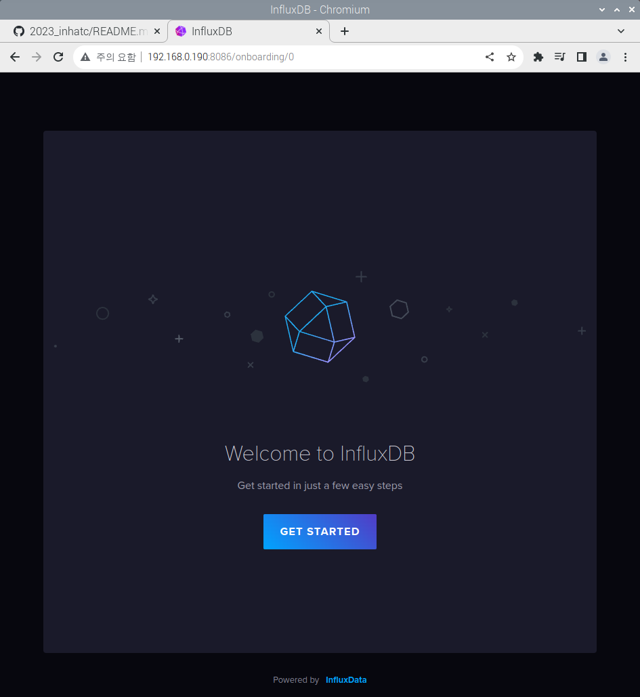
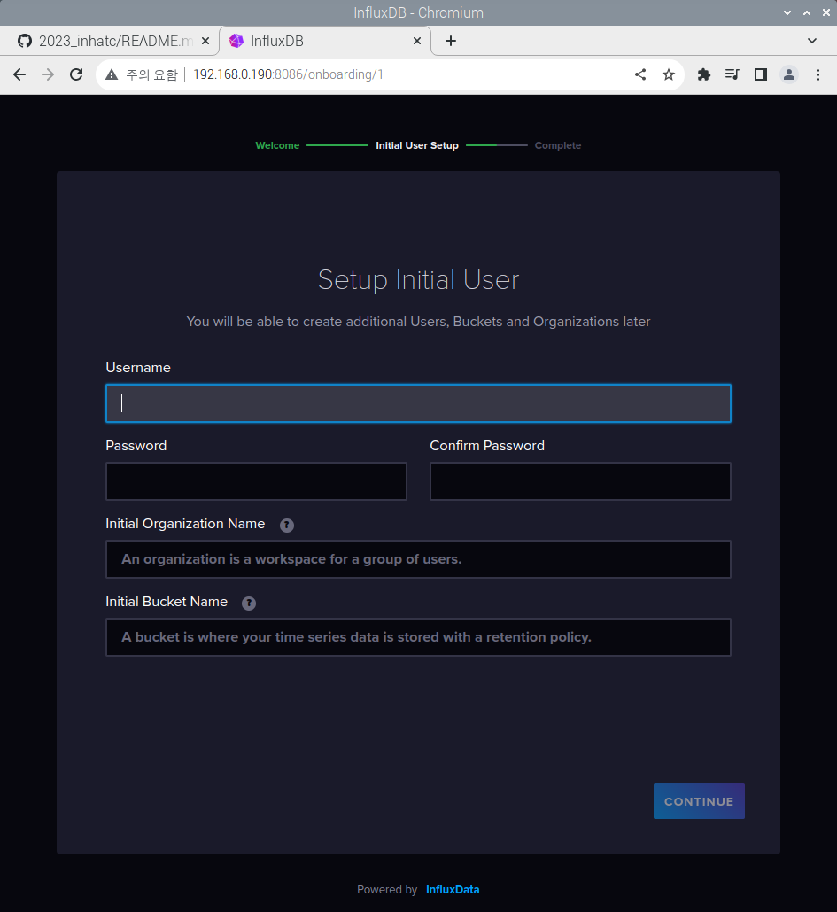

# 2023_inhatc
2023 년 3학년 2학기 (A,C반)

## 2023-09-05 라즈베리파이 실습 못함
  - A반 신수민, 조광연, 이재윤, 안진성 

## 라즈베리파이 초기 설정
```
sudo apt update
sudo apt upgrade
```

  - 한글깨짐
```
sudo apt-get install fonts-unfonts-core -y
sudo apt-get install ibus ibus-hangul -y
sudo reboot
```

## InfluxDB2 설치 
  - InfluxDB download key using wget
```
wget -q https://repos.influxdata.com/influxdata-archive_compat.key
echo '393e8779c89ac8d958f81f942f9ad7fb82a25e133faddaf92e15b16e6ac9ce4c influxdata-archive_compat.key' | sha256sum -c && cat influxdata-archive_compat.key | gpg --dearmor | sudo tee /etc/apt/trusted.gpg.d/influxdata-archive_compat.gpg > /dev/null
echo 'deb [signed-by=/etc/apt/trusted.gpg.d/influxdata-archive_compat.gpg] https://repos.influxdata.com/debian stable main' | sudo tee /etc/apt/sources.list.d/influxdata.list
```
  - Packages are up to date && install Influxdb
    
## InfluxDB 데이터베이스 만들기

```
$ influx

>create database <데이터베이스이름>
확인 : show databases 
```
  ```
 sudo apt-get update && sudo apt-get install influxdb2 -y

   에러) influxdb2 패키지 찾을수 없습니다.
      - influxdb 1으로 설치

sudo apt-get install influxdb -y
```


  - InfluxDB as a background service on startup
```
sudo service influxdb start
```
  - InfluxDB is status (service)
```
sudo service influxdb status
```

### InfluxDB2 web setting
  - localhost:8086 접속
  - GET STARTED

 </img>

  - Setup Initial User
  - (pi , raspberry)
  - Organization Name (study)
  - Bucket Name (DatabaseName)
    - test

   </img>

</strike>
# Grafana Installation

## 1. Repository의 GPG key를 더하기
```
wget -q -O - https://packages.grafana.com/gpg.key | sudo apt-key add -
```

## 2. Repository를 더하기
```
echo "deb https://packages.grafana.com/oss/deb stable main" | sudo tee -a /etc/apt/sources.list.d/grafana.list
```

## 3. 프로그램 설치
```
sudo apt update
sudo apt install grafana
```

## 4. 프로그램 실행
```
sudo service grafana-server start
```
## influxdb import with python
```
sudo pip3 install influxdb
```


